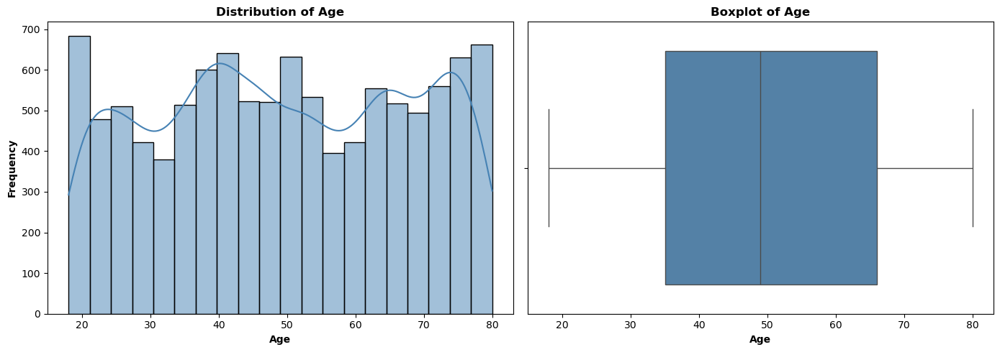
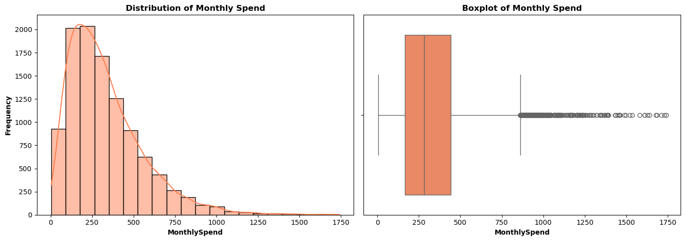
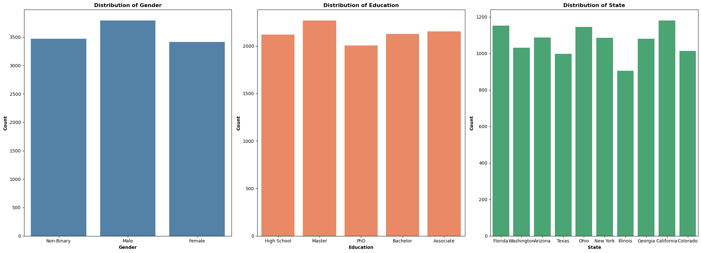
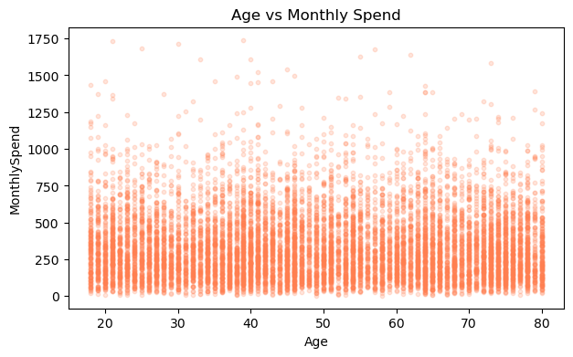
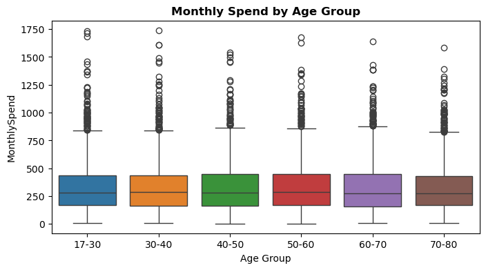
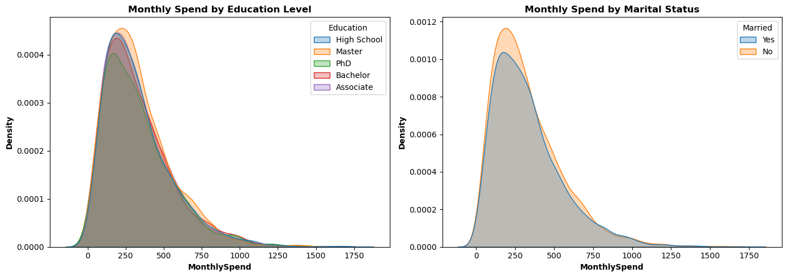
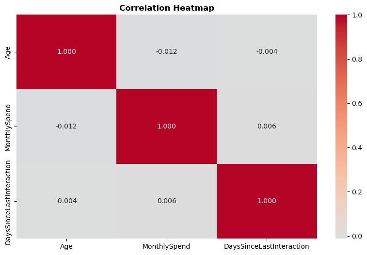

# 📊 Customer Insights --- Statistical Analysis in Python

> **A statistics-driven customer analytics project using Python,
> exploratory data analysis, bivariate analysis, and hypothesis
> testing.**

This project investigates customer spending behaviour, demographics, and
interaction recency using a structured statistical workflow. The goal
was not only to describe the data, but to test whether commonly used
demographic factors actually explain differences in customer spending.

------------------------------------------------------------------------

## 🎯 Project Objective

The analysis answers four practical questions:

-   Does **gender** influence average monthly spending?
-   Does **education level** influence average monthly spending?
-   Does **age** relate to customer interaction recency?
-   Does **state** influence average monthly spending?

The project combines **descriptive statistics + visual analytics +
inferential statistics** to move from observation to evidence-based
conclusions.

------------------------------------------------------------------------

## 🧰 Tech Stack

  Area                  Tools
  --------------------- ---------------------
  Language              Python
  Data manipulation     Pandas, NumPy
  Visualization         Matplotlib, Seaborn
  Statistical testing   SciPy
  Environment           Jupyter Notebook

**Core techniques:** data validation, datetime conversion, descriptive
statistics, distribution analysis, boxplots, countplots, scatterplots,
KDE plots, correlation analysis, crosstabulation, independent t-test,
one-way ANOVA, and Pearson correlation.

------------------------------------------------------------------------

## 📁 Dataset Snapshot

The notebook works with `US_Customer_Insights_Dataset.csv`.

-   **10,675 records**
-   **12 variables**
-   **1,000 unique Customer IDs**
-   No missing values detected
-   No duplicate rows detected
-   `JoinDate` and `TransactionDate` converted to datetime format

### Key variables

`CustomerID` · `State` · `Education` · `Gender` · `Age` · `Married` ·
`NumPets` · `JoinDate` · `TransactionDate` · `MonthlySpend` ·
`DaysSinceLastInteraction`

------------------------------------------------------------------------

## 🔎 Analytical Workflow

``` text
Data Loading
     ↓
Data Quality Checks
     ↓
Data Cleaning & Pre-processing
     ↓
Descriptive Statistics
     ↓
Univariate Visual Analysis
     ↓
Bivariate Analysis
     ↓
Hypothesis Formulation
     ↓
Statistical Testing
     ↓
Business Insights
```

------------------------------------------------------------------------

# 📈 Exploratory Analysis

## 1. Age Distribution

The age variable is broadly distributed across the 18--80 range. The
mean age is **49.47**, while the median is **49.00**, indicating very
little difference between the two central measures.

<p align="center">

</p>
```
**Takeaway:** Age does not show obvious extreme outliers in the dataset,
and the mean/median relationship suggests a relatively balanced
distribution.

------------------------------------------------------------------------

## 2. Monthly Spend Distribution

Monthly spending is **right-skewed**. Most observations are concentrated
around the lower spending range, while a smaller group extends into
substantially higher values.

<p align="center">

</p>
```
**Key statistics**

  Metric                    Value
  ---------------------- --------
  Mean Monthly Spend       331.61
  Median Monthly Spend     282.11
  Standard Deviation       225.80

**Takeaway:** The mean being higher than the median, together with the
long right tail and visible outliers, indicates the presence of
high-spending customers.

------------------------------------------------------------------------

## 3. Categorical Profile

The project also examined the distribution of **Gender, Education, and
State**.

<p align="center">

</p>
```
**Highlights**

-   Male is the largest gender group, but the three gender groups are
    relatively balanced.
-   Master's degree holders form the largest education group.
-   Florida has the highest customer count, followed closely by
    California.
-   The remaining states are relatively balanced in representation.

------------------------------------------------------------------------

# 🔬 Bivariate Analysis

## 4. Age vs Monthly Spend

The initial scatterplot does not show a clear linear relationship
between age and monthly spending.

<p align="center">

</p>
```
To make the comparison easier to interpret, age was also grouped into
six bands and compared using boxplots.

<p align="center">

</p>
```
**Takeaway:** Median spending remains broadly similar across age groups,
while high-spending outliers appear across multiple age bands.

------------------------------------------------------------------------

## 5. Spending by Education & Marital Status

<p align="center">

</p>
```
The spending distributions across education groups are highly similar.
Married and unmarried customers also show strongly overlapping spending
distributions.

------------------------------------------------------------------------

## 6. Correlation Analysis

The correlation matrix showed values very close to zero among **Age,
MonthlySpend, and DaysSinceLastInteraction**.

  Variable Pair                               Correlation
  ----------------------------------------- -------------
  Age ↔ MonthlySpend                               -0.012
  Age ↔ DaysSinceLastInteraction                   -0.004
  MonthlySpend ↔ DaysSinceLastInteraction           0.006

<p align="center">

</p>
```
**Takeaway:** These variables show no meaningful linear relationship in
this dataset.

------------------------------------------------------------------------

# 🧪 Hypothesis Testing

A significance level of **α = 0.05** was used.

  ---------------------------------------------------------------------------
  Business       Test                 Statistic          p-value Result
  Question                                                       
  -------------- ------------- ---------------- ---------------- ------------
  Do males and   Independent          t = 0.339            0.734 Fail to
  females spend  t-test                                          reject H₀
  differently?                                                   

  Does education One-way ANOVA        F = 0.229            0.922 Fail to
  affect monthly                                                 reject H₀
  spend?                                                         

  Is age related Pearson             r = -0.004            0.682 Fail to
  to interaction correlation                                     reject H₀
  recency?                                                       

  Does state     One-way ANOVA        F = 1.118            0.346 Fail to
  affect monthly                                                 reject H₀
  spend?                                                         
  ---------------------------------------------------------------------------

### Statistical conclusion

None of the four tested relationships produced a p-value below **0.05**.

Therefore, this analysis found **no statistically significant evidence**
that gender, education, or state explains differences in monthly
spending, and no statistically significant correlation between age and
days since last interaction.

> **Important:** "Fail to reject H₀" does not prove that the variables
> have absolutely no relationship. It means the analysis did not find
> sufficient statistical evidence of a relationship at the chosen
> significance level.

------------------------------------------------------------------------

# 💡 Key Business Insights

### 1. Demographics are weak predictors of spending

Gender, education, and state did not show statistically significant
differences in monthly spending. This suggests that demographic-only
segmentation may not be sufficient for identifying high-value customers.

### 2. High spenders exist across the customer base

Monthly spending is strongly right-skewed, with a visible group of
high-spending observations. These customers are not concentrated in one
obvious age segment.

### 3. Age is not a useful standalone engagement signal

The correlation between age and days since last interaction was
approximately **-0.004**, with **p = 0.682**. In this dataset, older
customers are not statistically less active.

### 4. Customer engagement needs deeper investigation

`DaysSinceLastInteraction` has a high standard deviation of **398.77
days**, indicating substantial variation in interaction recency. Since
the tested demographic variables do not explain this variation, future
analysis could investigate product, service, support, or
acquisition-channel factors.

------------------------------------------------------------------------

# 📌 What I Practiced / Demonstrated

This project demonstrates practical ability in:

-   Data loading and validation
-   Missing-value and duplicate checks
-   Datetime preprocessing
-   Descriptive statistics
-   Distribution and outlier analysis
-   Categorical analysis
-   GroupBy and cross-tabulation
-   Correlation analysis
-   Data visualization
-   Statistical hypothesis formulation
-   Independent t-tests
-   One-way ANOVA
-   Pearson correlation
-   Translating statistical output into business-oriented insights

------------------------------------------------------------------------

# 🗂️ Recommended Repository Structure

``` text
customer-insights-statistical-analysis/
│
├── README.md
├── Statistics_MiniProject.ipynb
├── US_Customer_Insights_Dataset.csv
├── Statistics_MiniProjectBy_ArijitDutta.html
├── Statistics_Mini_Project.pdf
│
└── assets/
    ├── age_distribution.png
    ├── monthly_spend_distribution.png
    ├── categorical_distributions.png
    ├── age_vs_monthly_spend.png
    ├── monthly_spend_by_age_group.png
    ├── monthly_spend_by_education_marital_status.png
    └── correlation_heatmap.png
```

> **Note:** Keep the dataset and notebook in the repository only if they
> are permitted to be shared publicly.

------------------------------------------------------------------------

# 🚀 How to Run

### 1. Clone the repository

``` bash
git clone <your-repository-url>
cd customer-insights-statistical-analysis
```

### 2. Install dependencies

``` bash
pip install pandas numpy matplotlib seaborn scipy jupyter
```

### 3. Launch Jupyter

``` bash
jupyter notebook
```

Open `Statistics_MiniProject.ipynb` and run the cells.

------------------------------------------------------------------------

# 📄 Project Report

For a quick review without running the notebook:

-   **HTML:** `Statistics_MiniProjectBy_ArijitDutta.html`
-   **PDF:** `Statistics_Mini_Project.pdf`

The HTML export preserves the notebook workflow and outputs.

------------------------------------------------------------------------

## 👤 Author

**Arijit Dutta**

Data Analyst \| Python \| SQL \| Excel \| Data Visualization

------------------------------------------------------------------------

### ⭐ If you found this analysis useful, consider starring the repository.
